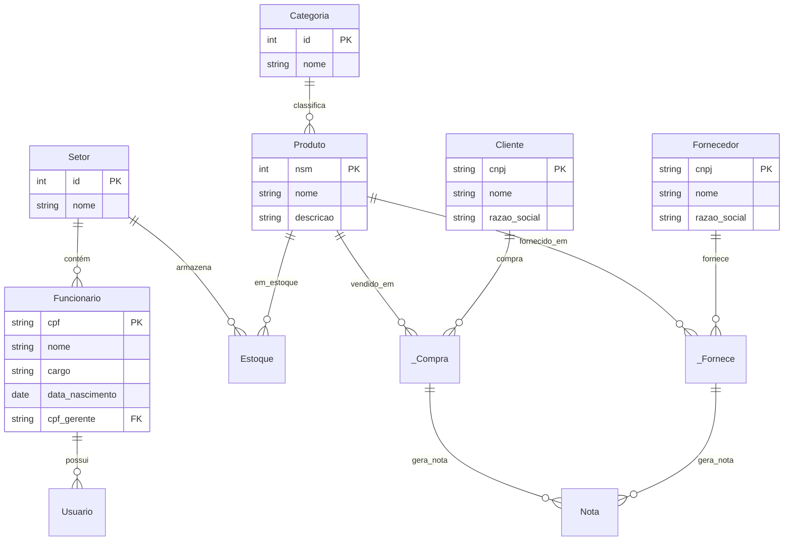

<div align="center">

# 🏭 Sistema de Gestão para Distribuidora Bravi

*Sistema completo de banco de dados relacional para otimização das operações da Bravi Distribuidora*


<p align="center">
  
</p>

<p align="center">
  
  
  
  
</p>

</div>

## 📋 Sobre o Projeto

Sistema de gestão empresarial desenvolvido para a **Bravi Distribuidora** com um banco de dados relacional robusto que gerencia:

- 👥 **Recursos Humanos** (Funcionários, Setores, Hierarquia)
- 📦 **Gestão de Produtos** e Categorias
- 🏢 **Cadastro de Fornecedores** e Clientes
- 💰 **Controle de Compras** e Fornecimentos
- 📊 **Gestão de Estoque** em tempo real
- 🧾 **Emissão de Notas** Fiscais automáticas
---

## 🏗️ Arquitetura do Banco de Dados

### 📊 Esquema Relacional



### 🗃️ Estrutura de Tabelas

| **Tabela** | **Chave Primária** | **Descrição** |
|------------|-------------------|---------------|
| `Setor` | `id` AUTO_INCREMENT | Departamentos da empresa |
| `Funcionario` | `CPF` VARCHAR(14) | Cadastro de colaboradores |
| `Usuario` | `id` AUTO_INCREMENT | Sistema de autenticação |
| `Produto` | `NSM` INTEGER | Catálogo de produtos |
| `Categoria` | `id` AUTO_INCREMENT | Classificação de produtos |
| `Fornecedor` | `CNPJ` VARCHAR(20) | Parceiros comerciais |
| `Cliente` | `CNPJ` VARCHAR(20) | Base de clientes |
| `Estoque` | Composite (`fk_Setor_id`, `fk_Produto_NSM`) | Controle de inventário |

---

## ⚡ Triggers e Automatizações

### 🔄 Sistema de Triggers Implementado

| **Trigger** | **Evento** | **Ação** |
|-------------|------------|----------|
| `after_funcionario_insert` | INSERT em Funcionario | Cria usuário automaticamente |
| `after_compra_insert` | INSERT em _Compra | Atualiza estoque (-1) e gera nota |
| `after_fornece_insert` | INSERT em _Fornece | Atualiza estoque (+1) e gera nota |
| `after_produto_insert` | INSERT em Produto | Associa categoria automaticamente |

### 💡 Exemplo de Trigger

```sql
DELIMITER //
CREATE TRIGGER after_compra_insert
AFTER INSERT ON _Compra
FOR EACH ROW
BEGIN
    -- Atualiza estoque ou insere novo registro
    UPDATE Estoque SET qtd = qtd - 1 
    WHERE fk_Produto_NSM = NEW.fk_Produto_NSM;
    
    -- Gera nota fiscal automaticamente
    INSERT INTO Nota (fk_Compra_id, is_in, data) 
    VALUES (NEW.id, TRUE, NOW());
END //
DELIMITER ;
```

---

## 📈 Principais Funcionalidades

### 👥 Gestão de Recursos Humanos

| **Recurso** | **Implementação** | **Benefício** |
|-------------|-------------------|---------------|
| **Hierarquia Organizacional** | Auto-relacionamento em Funcionario | Gestão de subordinados |
| **Cadastro Automático de Usuários** | Trigger `after_funcionario_insert` | Redução de erros manuais |
| **Controle de Acessos** | Campo `isGerente` na tabela Usuario | Segurança granular |

### 📦 Gestão de Estoque Inteligente

| **Operação** | **Trigger** | **Resultado** |
|-------------|-------------|---------------|
| **Venda Realizada** | `after_compra_insert` | Estoque decrementado + Nota gerada |
| **Recebimento de Fornecedor** | `after_fornece_insert` | Estoque incrementado + Nota gerada |
| **Produto Novo** | `after_produto_insert` | Categoria associada automaticamente |

### 💰 Processos Comerciais

- **🎯 Fornecimento**: Tabela `_Fornece` com valores negociados
- **🛒 Compras**: Tabela `_Compra` com histórico de vendas
- **🧾 Notas Fiscais**: Geração automática via triggers
- **📊 Estoque**: Controle em tempo real por setor

---

## 🚀 Guia de Instalação

### 📋 Pré-requisitos

| **Componente** | **Versão** | **Download** |
|----------------|------------|--------------|
| **MySQL** | 8.0+ | [MySQL Community](https://dev.mysql.com/downloads/) |
| **Java JDK** | 21+ | [Oracle JDK](https://www.oracle.com/java/) |
| **Git** | 2.30+ | [Git SCM](https://git-scm.com/) |

### 🛠️ Configuração do Banco de Dados

#### 1. 📥 Clone do Repositório
```bash
git clone https://github.com/P-E-N-T-E-S/Bravi_mySQL.git
cd Bravi_mySQL
```

#### 2. 🗄️ Execução dos Scripts SQL
```bash
# Execute no MySQL Client ou Workbench
mysql -u root -p < BDBravi/codigoBanco.sql
mysql -u root -p < BDBravi/povoamentoBanco.sql
```

#### 3. ⚙️ Estrutura Criada
O script `codigoBanco.sql` criará:
- ✅ 11 tabelas normalizadas
- ✅ 4 triggers de automação
- ✅ Constraints de integridade referencial
- ✅ Índices primários e estrangeiros

### 🔧 Configuração da Aplicação

Crie o arquivo `.env` na pasta `Bravi`:

```env
# Configurações do Banco de Dados
DATABASE_URL=jdbc:mysql://localhost:3306/BDBravi
DATABASE_USERNAME=seu_usuario
DATABASE_PASSWORD=sua_senha

# Configurações da Aplicação Spring Boot
SERVER_PORT=8080
SPRING_PROFILES_ACTIVE=dev
```

### 🏃 Execução

**Terminal (Linux/Mac):**
```bash
cd Bravi
chmod +x mvnw
./mvnw clean install
./mvnw spring-boot:run
```

**Acesso:**
```url
http://localhost:8080/login
```

---

## 🔐 Sistema de Autenticação

### 👤 Credenciais Automáticas

| **CPF (Usuário)** | **Nome (Senha)** | **Cargo** | **isGerente** |
|-------------------|------------------|-----------|---------------|
| 44444444444 | João Silva | Gerente | TRUE |
| 55555555555 | Maria Oliveira | Vendedor | FALSE |
| 66666666666 | Carlos Souza | Vendedor | FALSE |

**💡 Dica:** As credenciais são criadas automaticamente via trigger quando um funcionário é inserido!

---

## 👥 Equipe de Desenvolvimento

<div align="center">

### 💻 Arquitetos de Banco de Dados

<table>
  <tr>
    <td align="center">
      <a href="https://github.com/Thomazrlima">
        <br>
        <sub><b>Thomaz R. Lima</b></sub><br>
        <sub>trl@cesar.school</sub><br>
        <sub>🗄️ Modelagem Relacional</sub><br>
        <sub>⚡ Triggers & Stored Procedures</sub>
      </a>
    </td>
    <td align="center">
      <a href="https://github.com/Sofia-Saraiva">
        <br>
        <sub><b>Sofia Saraiva</b></sub><br>
        <sub>spscl@cesar.school</sub><br>
        <sub>🔍 Normalização</sub><br>
        <sub>📊 Consultas Otimizadas</sub>
      </a>
    </td>
  </tr>
</table>

</div>

---

## 📄 Licença

Este projeto está licenciado sob a **MIT License** - veja o arquivo [LICENSE](LICENSE) para detalhes.

---

<div align="center">

**🏭 Transformando operações distribuidoras através de um banco de dados robusto e inteligente**

*Desenvolvido com 💙 pela equipe P.E.N.T.E.S. para a Bravi Distribuidora*

</div>
